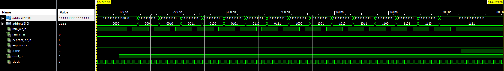
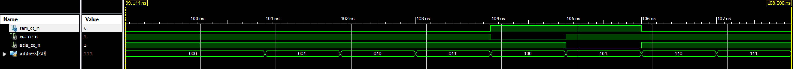

# Bootstrapping MMU

This is an MMU that will copy the contents of EEPROM into SRAM before commencing
it's MMU duties. Ultimately I hope it fits into the smallest (XC2C32A)
CoolRunnner II CPLD since I have 5 of them.

## Memory Copier

Here's the simulation of [`memory_copier.v`](memory_copier.v) configured for a
16 byte EEPROM. On reset it starts incrementing addresses and pulsing the SRAM
write enable pin. It uses 4 clock cycles per address:

1. Let the address and data bus settle.
2. Start write.
3. End write.
4. Increment address and go to 1. If this was the last address go to a done
   state.

Once the transfer is complete it sets the `done` signal to high.

## MMU

The MMU looks at the highest three bits of the address which gives it a
granularity of 8KB. This can be easily reconfigured by looking at more address
bits.

Here RAM is mapped everywhere except for 8KB starting at 0x8000 and another 8KB
at 0xA000.

