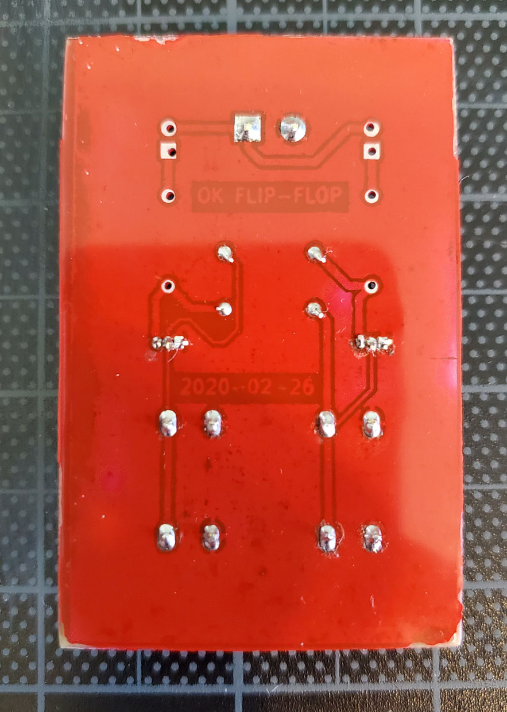

# Flip-Flop

Storage for 1-bit of information but only when it's sunny:

Here are some photos half way through assembly along with a screenshot from
KiCad. Behold the red solder mask!

Front                     | PCB                 | Back
:------------------------:|:-------------------:|:------------------------:
 |  | 

