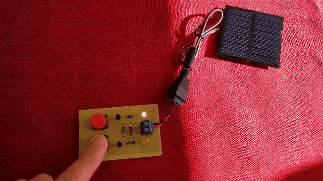
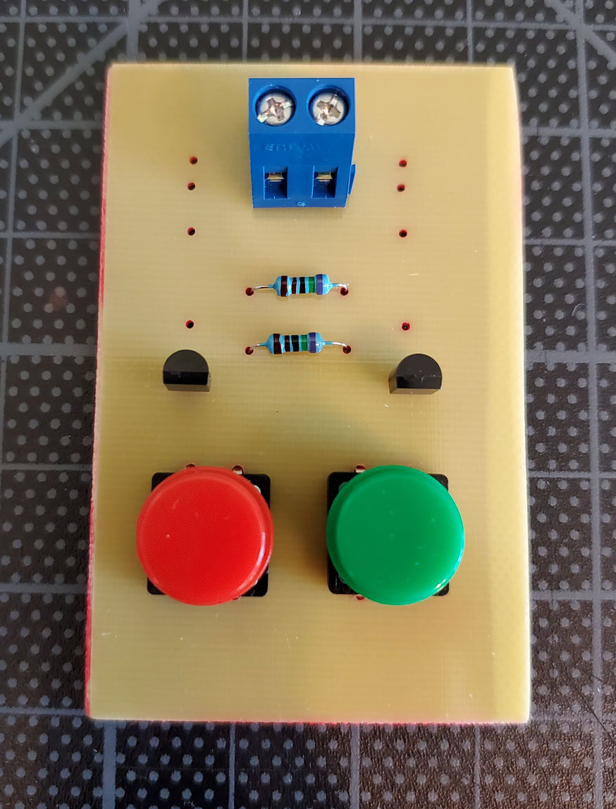
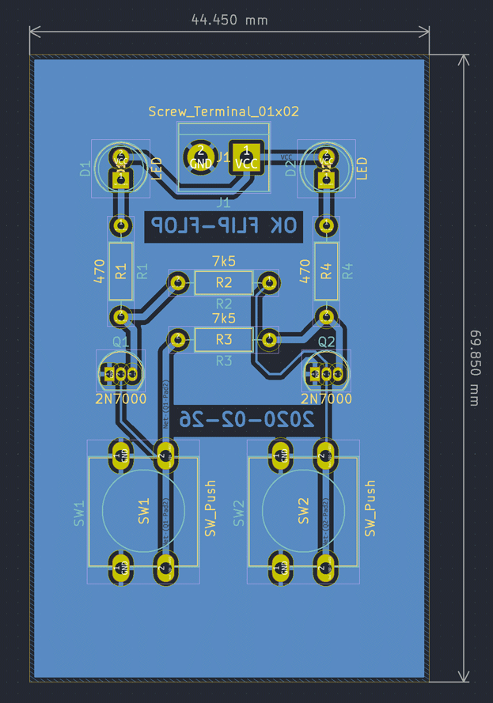
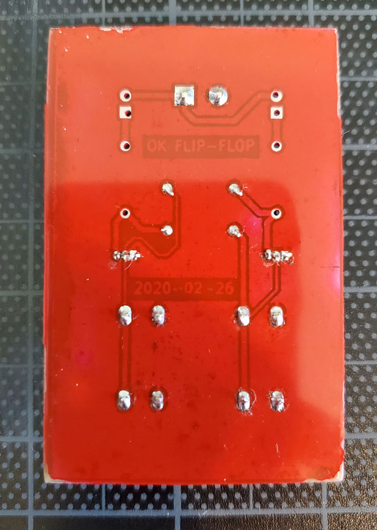

# Flip-Flop

Storage for 1-bit of information but only when it's sunny:

Here are some photos half way through assembly. Behold the red solder mask!

Front                     | Pcb                 | Back
:------------------------:|:-------------------:|:-------------------------:
 |  | 

