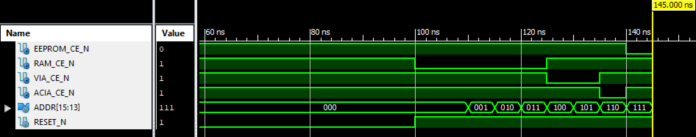

# Testing HardCaml with an MMU

This is a simple "MMU" for a 65C02 microcomputer. I'm not sure if this is really
an MMU but it does control what devices are mapped to what memory address. It
decides whether the EEPROM, RAM, VIA, or ACIA are enabled based on the state of
the most significant address bits.

This project has been built on Windows with OCaml 4.02.3. That may sound pretty
out of date.  And it is but I couldn't get opam to resolve dependencies with newer
versions (I didn't try very hard).

There is a "reference" implementation in the [verilog](verilog) subdirectory.

File               | Description
-------------------|---------------------------------------------------
[`reference_mmu.v`](verilog/reference_mmu.v) | Reference implementation of the MMU.
[`main.v`](verilog/main.v)                    | Toplevel board intended to be used with [`main.ucf`](verilog/main.ucf)
[`hardcaml_mmu.v`](verilog/hardcaml_mmu.v)   | The HardCaml implementation from running `mmu.exe`

Both of the modules generate the following results under test. It's probably
correct since only one of the output signals is low at any given time.

