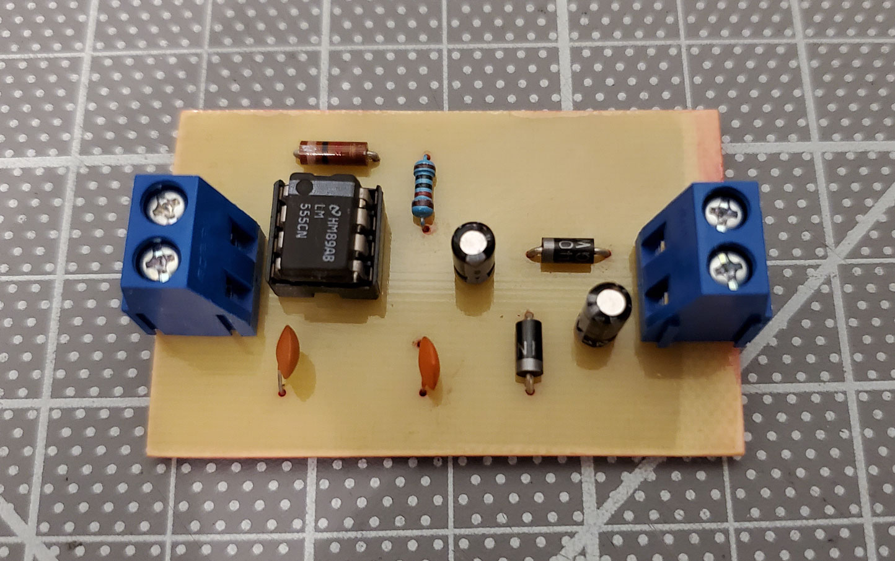
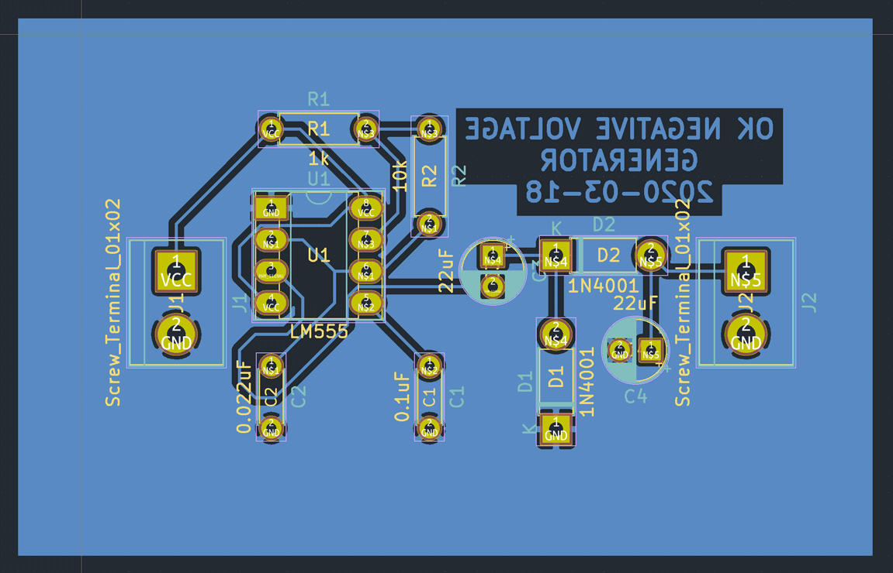

# Negative Voltage Generator

The schematic is specified in SKiDL and the resulting netlist is imported in
KiCad for board layout.

Front                 | PCB                 | Back
:--------------------:|:-------------------:|:--------------------:
 |  | 
