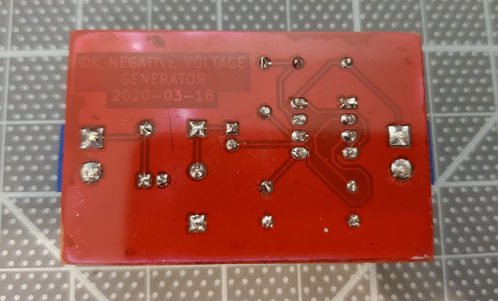

# Negative Voltage Generator

The schematic is specified in SKiDL and the resulting netlist is imported in
KiCad for board layout.  This is the second board I've ever etched.

Side                  | Image 
:--------------------:|:-------------------:
Front                 | 
PCB                   | 
Back                  |  
